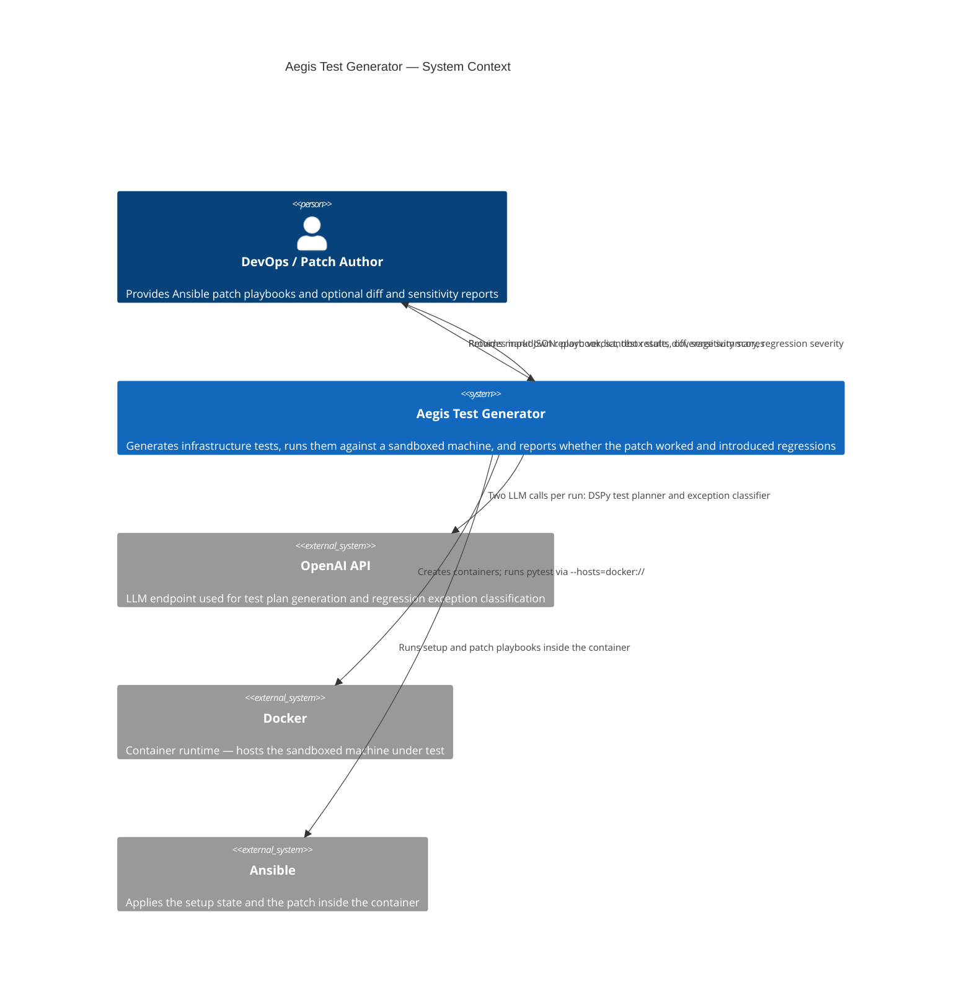
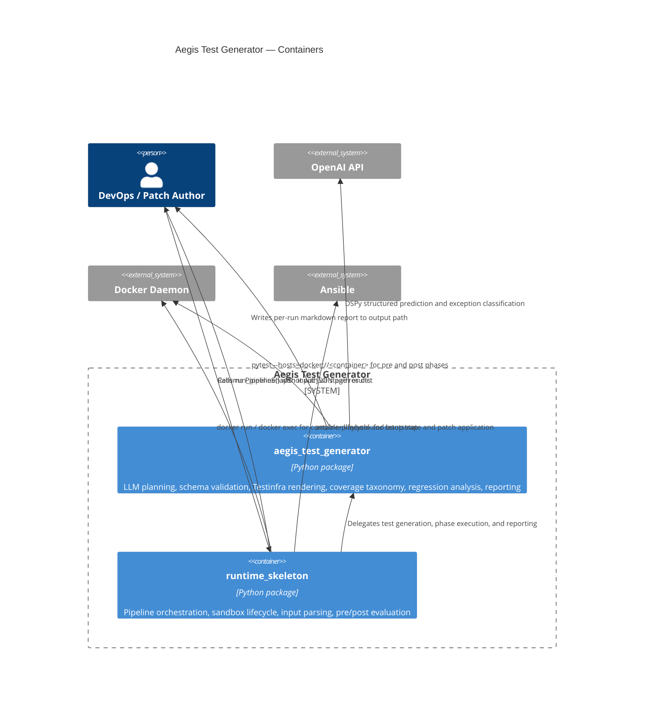
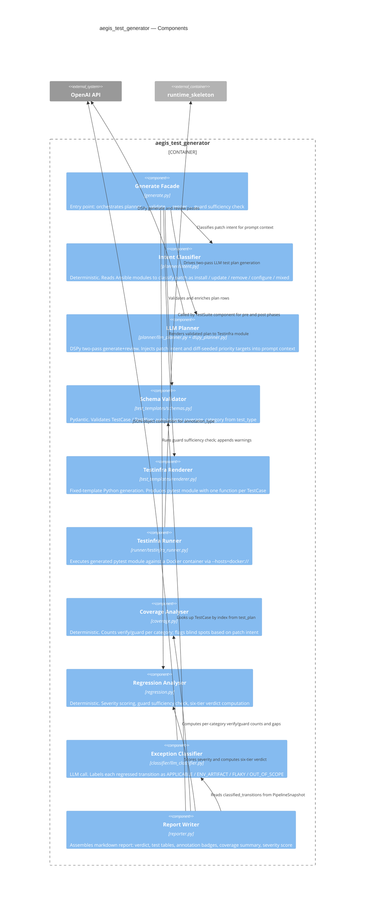
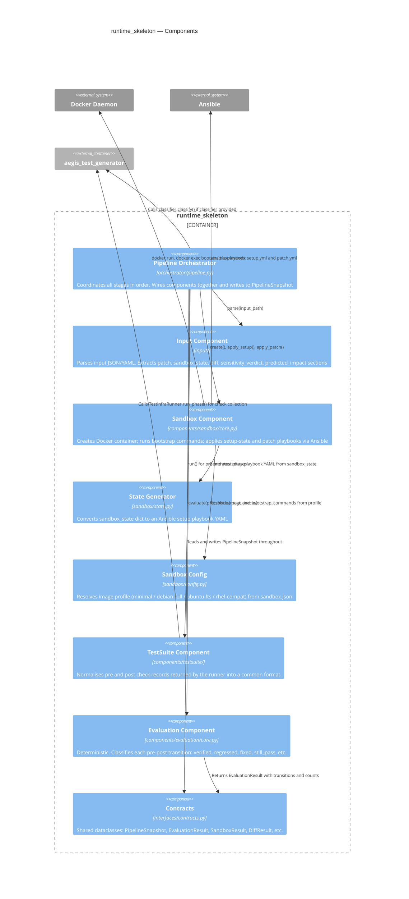

# Aegis Architecture — C4 Diagrams

Structural view of the system at three levels of zoom: context (what the system is),
containers (the two packages and their external dependencies), and components (what
lives inside each package).

---

## Level 1 — System Context

Who uses Aegis, and what external systems does it depend on.

---

## Level 2 — Containers

The two Python packages and how they divide responsibility.

---

## Level 3 — Components: `aegis_test_generator`

The internal modules of the test generator package.

---

## Level 3 — Components: `runtime_skeleton`

The internal modules of the pipeline and sandbox package.

