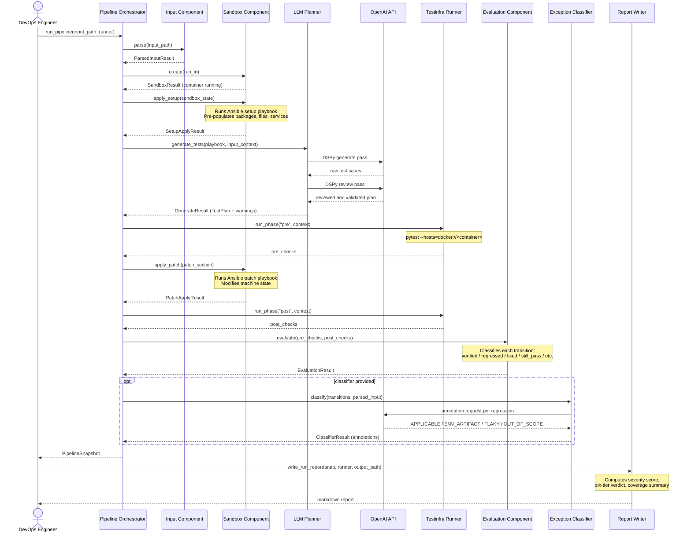
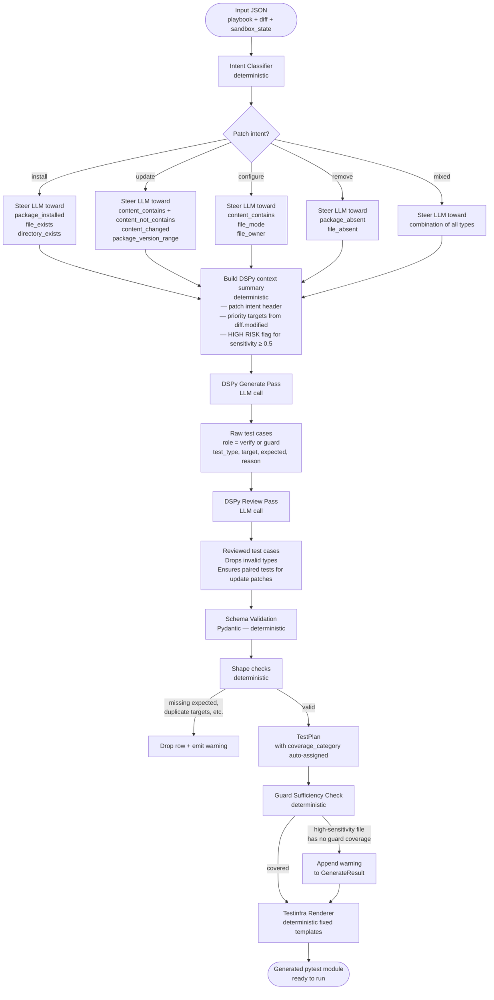

# Aegis Architecture — Flow Diagrams

Behavioral view of the system: how a pipeline run executes from start to finish,
and how a patch playbook becomes a typed test plan.

---

## Pipeline Execution Sequence

The full lifecycle of one `run_pipeline()` call, showing which component handles each
stage and the two optional LLM calls (test planning and exception classification).

---

## Test Generation Decision Flow

How a patch playbook becomes a validated, typed test plan. Deterministic stages are
marked; LLM calls are the two DSPy passes in the middle.

