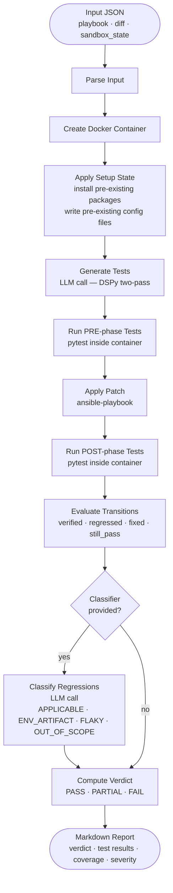

# Aegis Pipeline

```mermaid
flowchart TD
    A([Input JSON\nplaybook · diff · sandbox_state]) --> B

    B[Parse Input] --> C[Create Docker Container]
    C --> D[Apply Setup State\ninstall pre-existing packages\nwrite pre-existing config files]
    D --> E

    E[Generate Tests\nLLM call — DSPy two-pass] --> F[Run PRE-phase Tests\npytest inside container]
    F --> G[Apply Patch\nansible-playbook]
    G --> H[Run POST-phase Tests\npytest inside container]
    H --> I[Evaluate Transitions\nverified · regressed · fixed · still_pass]

    I --> J{Classifier\nprovided?}
    J -- yes --> K[Classify Regressions\nLLM call\nAPPLICABLE · ENV_ARTIFACT · FLAKY · OUT_OF_SCOPE]
    K --> L
    J -- no --> L

    L[Compute Verdict\nPASS · PARTIAL · FAIL] --> M([Markdown Report\nverdict · test results · coverage · severity])
```
